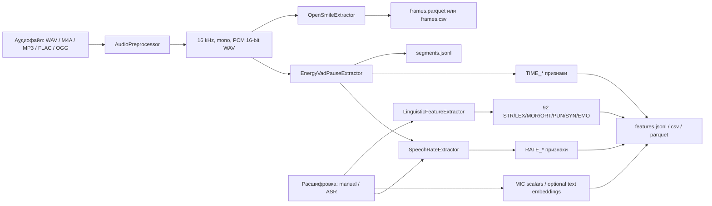

# Описание работы пайплайна SARA-audio

## Назначение

Пайплайн извлекает из одного аудиофайла четыре независимых набора данных:

1. Акустические frame-level признаки openSMILE.
2. Речевые сегменты, паузы и временные характеристики реплики.
3. Скорость речи, нормированную на активную речь.
4. MIC-совместимые scalar-признаки и, опционально, text embeddings.
5. Реестр 92 лингвистических параметров из исходного DOCX, если передана
   расшифровка. Текущий эвристический backend возвращает все 92 кода с
   provenance и confidence.

Каждое скалярное значение хранится вместе с источником, уверенностью,
версией метода и диагностическими сведениями. Неопределенный параметр не
заменяется нулем: он записывается как `null` с объяснением в `evidence`.

## Последовательность обработки

Для поставки `data/new_raw_data` используется отдельный профиль
`sara_audio.external_delivery`, без повторного ASR:

1. Проверка SHA-256 исходников по `NEW_RAW_DATA_INVENTORY.json`.
2. Связывание по ID 390 расшифровок и 385 WAV, включая WAV внутри test.zip.
3. Выбор реплик оператора из последней обработанной версии. Исключение
   меток времени, ролей и только документированных маркеров замены «Тишина».
4. Расчет прежних 19 текстовых признаков. Сохранение всех 92 кодов и причин
   недоступности остальных 73. Обе исходные версии диалога копируются рядом.
5. Независимый расчет акустики и VAD-пауз по доступному WAV. Скорости речи
   не вычисляются: временная шкала полного диалога не соответствует WAV.
6. Проверка результатов, сборка CSV-сводок, словаря, описания и ZIP с SHA-256.

Записи обрабатываются независимо; число процессов задается `workers` в
`config/external_delivery.yaml`. Ошибка отдельной записи фиксируется в
`run_summary.json`, остальные продолжают обрабатываться. Итоговый архив
не публикуется, если хотя бы одна запись завершилась ошибкой.

Следующая схема описывает стандартный аудиопайплайн, а не импорт этого корпуса.



## 1. Подготовка аудио

`AudioPreprocessor` приводит вход к формату `mono PCM WAV`, `16 kHz`,
`16-bit`. Если файл уже соответствует формату, он используется без
перекодирования. Иначе запускается `ffmpeg`: сначала системный из `PATH`,
а при его отсутствии бинарник из зависимости `imageio-ffmpeg`.

Нормализованный WAV помещается в `--cache-dir` (по умолчанию
`artifacts/normalized`). Именно этот файл служит входом для VAD и openSMILE,
поэтому оба модуля работают с одинаковым сигналом.

## 2. VAD и паузы

`EnergyVadPauseExtractor` делит нормализованный WAV на окна по `30 ms` и
считает RMS-энергию каждого окна в dBFS. Речевым считается кадр выше
адаптивного порога: максимум из абсолютного порога `-45 dBFS` и оценки
фонового шума плюс `10 dB`.

Последовательности речевых кадров короче `90 ms` отбрасываются. Соседние
речевые отрезки склеиваются, если расстояние между ними меньше `300 ms`.
Это утвержденный порог паузы: микропауза не становится отдельной паузой.

Расчетные значения:

| Код | Расчет |
| --- | --- |
| `TIME_first_pause_s` | От `0` до начала первого речевого сегмента. При отсутствии речи: `null`. |
| `TIME_mean_internal_pause_s` | Среднее расстояний между соседними речевыми сегментами. Первая и хвостовая паузы исключены. Если внутренних пауз нет: `null`. |
| `TIME_replica_duration_s` | От начала первого до конца последнего речевого сегмента. |
| `TIME_active_speech_duration_s` | Сумма продолжительностей речевых сегментов. Это длительность без пауз. |
| `TIME_audio_duration_s` | Полная длительность WAV по заголовку. |

В `segments.jsonl` сохраняются сами речевые сегменты и паузы с типом
`first`, `internal` или `trailing`; это позволяет перепроверить любой
агрегированный показатель.

## 3. openSMILE

`OpenSmileExtractor` запускает два штатных набора LLD openSMILE:

| Набор | Назначение |
| --- | --- |
| `ComParE_2016` | Energy, loudness, MFCC, SHS F0, jitter, shimmer, HNR, sharpness, spectral harmonicity и широкий набор спектральных LLD. |
| `eGeMAPSv02` | LPC-форманты `F1–F3`, полосы `F1–F3 bandwidth` и F0 harmonic-ratio признаки. |

У наборов разные окна анализа: `ComParE_2016` использует `60 ms`, а
`eGeMAPSv02` -- `20 ms`; шаг обоих равен `10 ms`. Поэтому строки не
сопоставляются принудительно по времени. Они складываются в один артефакт,
но получают поле `frame_source`. Поля `start` и `end` из Parquet/CSV всегда
относятся к окну того набора, который указан в `frame_source`.

`features.manifest.json` содержит `opensmile_semantic_coverage`: для каждой
семантической группы указан точный список реально созданных колонок. Пустой
список означает отсутствие покрытия, а не нулевое значение. В текущей
конфигурации отдельно не выводится F0 ACF/Cepstrum: поле
`f0_acf_cepstrum` в manifest останется пустым до добавления custom-конфига
openSMILE для этого алгоритма.

## 4. Расшифровка и скорость речи

Расшифровку можно передать как `--text`, `--text-file` или получить
`--transcribe` через опциональный `faster-whisper`. Ручной текст считается
проверенным (`is_verified=true`), ASR-текст -- непроверенным.

Из текста выделяются слова. Затем вычисляются:

```text
words_per_second_active     = число слов / TIME_active_speech_duration_s
chars_per_second_active     = число букв в словах / TIME_active_speech_duration_s
syllables_per_second_active = число русских гласных / TIME_active_speech_duration_s
```

Первая и внутренние паузы не входят в знаменатель, потому что используется
только сумма речевых сегментов. `RATE_phonemes_per_second_active` пока
присутствует с `null`: для него нужен подключенный русский G2P-модуль.

Без расшифровки рассчитываются VAD и openSMILE, но `RATE_*` и 92
лингвистических значения не создаются.

## 5. Лингвистические параметры

Список не поддерживается вручную. Генератор
`tools/generate_feature_plan.py` считывает таблицы исходного DOCX и создает
`src/sara_audio/data/linguistic_features.json`. При генерации проверяются:

- всего `92` уникальных кода;
- `STR=16`, `LEX=20`, `MOR=14`, `ORT=8`, `PUN=7`, `SYN=16`, `EMO=11`;
- непустые описание и группа для каждого кода.

`LinguisticFeatureExtractor` создает запись для каждого кода из реестра.
Прозрачные правила уже считают наблюдаемые счетчики: эмоциональную и
сниженную лексику, логические связки, союзы, частицы, сравнения и часть
пунктуации. Параметры, требующие полноценного русского морфологического,
синтаксического или семантического анализа, сохраняются с `value=null` и
`source=not-computed`.

Для `ORT_*` и пунктуационных признаков текст ASR помечается пониженной
уверенностью. Орфографическую оценку можно считать достоверной только по
проверенной расшифровке.

## 6. Выходные артефакты

`exclude_features.txt` применяется только к итоговым wide/delivery-таблицам.
Long-form per-record `features.*` сохраняет полный рассчитанный набор для
аудита и диагностики.

| Артефакт | Содержимое |
| --- | --- |
| `records/<record>/report.json` | Основной понятный отчет: статус расшифровки, временные признаки, скорость, 92 параметра с описаниями и покрытие openSMILE. |
| `records/<record>/features.csv` и `.json` | Long-form скалярные записи для просмотра: `file_id`, `feature_code`, `value`, `unit`, `source`, `confidence`, `method_version`, `evidence`. |
| `records/<record>/features.parquet` | Те же скалярные записи для аналитических инструментов. |
| `records/<record>/frames.csv` и `.parquet` | Frame-level LLD openSMILE, индекс `file/start/end`, а также `file_id` и `frame_source`. |
| `records/<record>/segments.json` | Речевые сегменты, первая/внутренние/хвостовая паузы, расшифровка и диагностика. |
| `records/<record>/manifest.json` | Диагностика записи и фактическое покрытие запрошенных групп openSMILE. |
| `run_summary.json` | Сопоставление каждого исходного аудиофайла с его каталогом результатов. |
| `predictions.csv` и `.json` | Компактный итог методологического каскада: выгорание, бинарный результат, пол и группа «оператор-год». |
| `interpretation_input.csv` и `.json` | Полная таблица информативных записей, включая реконструированные экспертные показатели, пол и выгорание. |
| `filter_predictions.csv` и `.json` | Score и решение фильтра по каждому входному файлу, включая исключённые записи. |

## Запуск

```powershell
sara-extract data\raw
sara-extract data\raw results\experiment-01
```

Параметры извлечения и режим расшифровки задаются только в
`config/default.yaml`; структура каталогов описана в `USER_GUIDE.md`.

Для проверки неизменности реестра:

```powershell
sara-validate-registry
```
